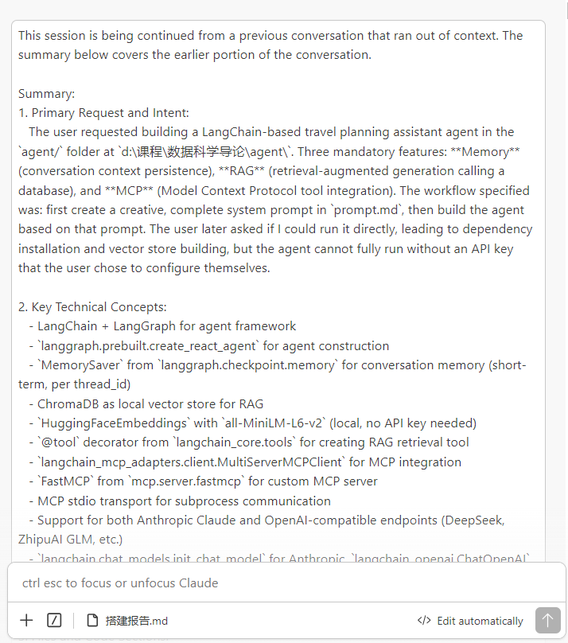
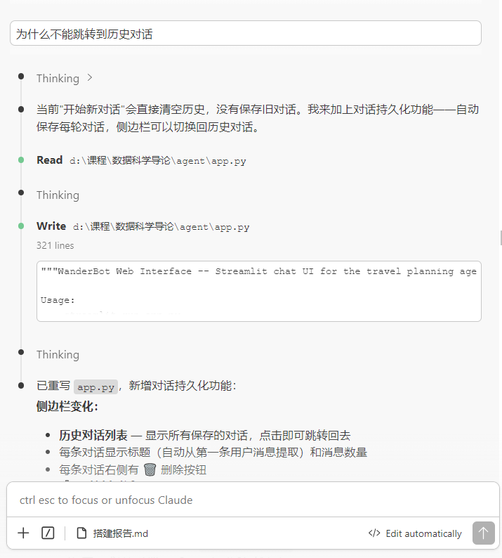
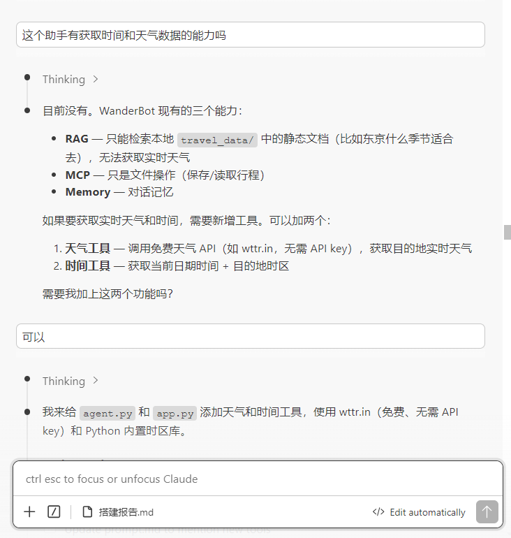
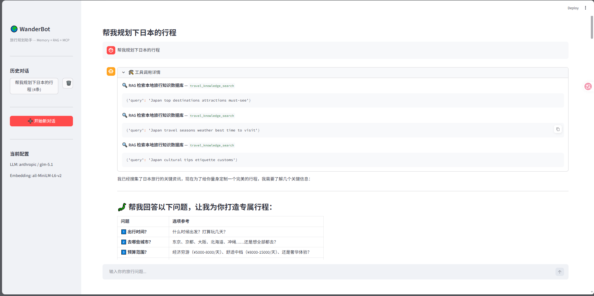
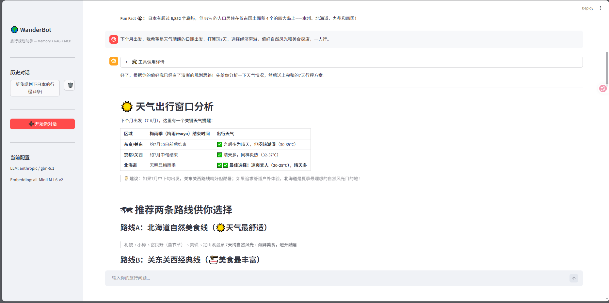
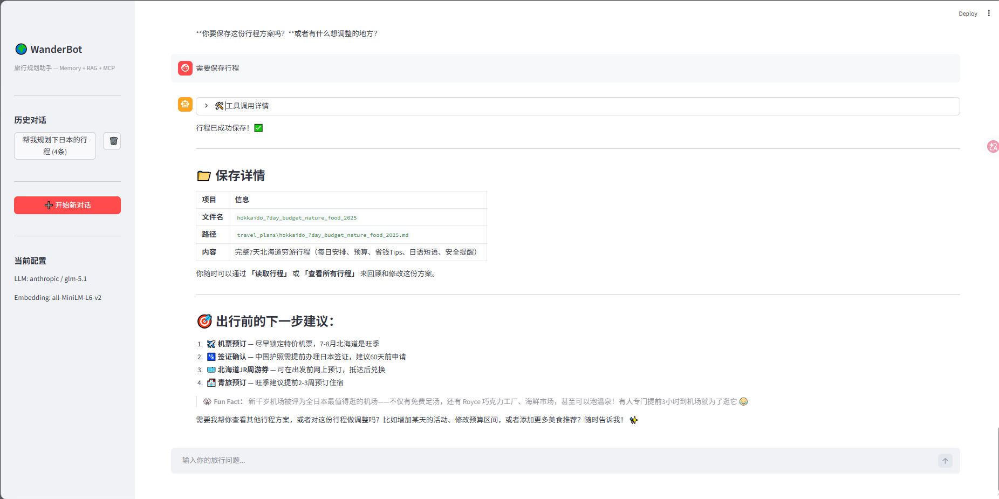

# WanderBot 旅行规划助手 — 搭建报告

## 与大模型的交互截图






## 项目概述

基于 LangChain + LangGraph 构建的智能旅行规划 Agent，具备 Memory、RAG、MCP 三大核心功能，提供 Streamlit Web 对话界面。

## 技术架构

| 组件 | 技术选型 | 说明 |
|------|----------|------|
| Agent 框架 | LangGraph `create_react_agent` | ReAct 模式，LLM 自行决定何时调用工具 |
| LLM | Anthropic Claude (百炼代理) | glm-5.1 模型，通过 Anthropic 兼容端点接入 |
| Memory | `MemorySaver` (LangGraph) | 按 thread_id 保存对话上下文，支持多轮记忆 |
| RAG | ChromaDB + HuggingFaceEmbeddings | 本地向量库，7 篇旅行知识文档，嵌入模型 all-MiniLM-L6-v2 |
| MCP | `FastMCP` + `langchain-mcp-adapters` | 自定义 MCP 服务器，提供行程文件操作工具 |
| 天气 | wttr.in API | 免费、无需 API Key，获取目的地实时天气 |
| 时间 | Python `zoneinfo` | 30+ 城市timezone映射，获取当地时间 |
| 界面 | Streamlit | Web 聊天界面，对话持久化到本地 JSON |

## 工具清单

| 工具名 | 类型 | 功能 |
|--------|------|------|
| `travel_knowledge_search` | RAG | 检索本地旅行知识数据库 |
| `get_weather` | API | 获取目的地实时天气 |
| `get_current_time` | 内置 | 获取目的地当前时间与时区 |
| `save_travel_plan` | MCP | 保存行程为 .md 文件 |
| `read_travel_plan` | MCP | 读取已保存行程 |
| `list_travel_plans` | MCP | 列出所有已保存行程 |

## 文件结构

```
agent/
├── agent.py           # CLI 入口，Agent 核心逻辑
├── app.py             # Streamlit Web 界面
├── rag_setup.py       # 向量库构建脚本
├── mcp_server.py      # MCP 服务器（行程文件操作）
├── mcp_config.json    # MCP 连接配置
├── prompt.md          # Agent 系统提示词
├── .env               # 环境变量（API Key 等）
├── .env.example       # 环境变量模板
├── requirements.txt   # Python 依赖
├── travel_data/       # RAG 知识源（7 篇 .md 文档）
│   ├── tokyo.md / paris.md / new_york.md / bangkok.md
│   ├── travel_tips.md / culture_food.md / weather_seasons.md
├── chroma_db/         # ChromaDB 向量库（自动生成）
├── travel_plans/      # 保存的旅行计划（MCP 工具生成）
└── conversations/     # 对话历史（Streamlit 自动保存）
```

## 运行方式

```bash
pip install -r requirements.txt     # 安装依赖
python rag_setup.py                 # 构建向量库（首次运行一次）
python -m streamlit run app.py      # 启动 Web 界面
```

## 运行结果截图






## 关键设计决策

1. **RAG 作为 @tool 而非注入 prompt** — LLM 自行判断何时检索，避免无关信息干扰
2. **MCP 通过 stdio 传输** — Agent 启动时以子进程方式连接 MCP 服务器
3. **Memory 按 thread_id 管理** — "开始新对话"切换新 thread_id，旧对话持久保存
4. **Anthropic 兼容端点** — 支持百炼等国内代理，通过 `anthropic_api_url` 参数配置
5. **对话持久化** — 每轮对话自动保存到 `conversations/` 目录，支持历史对话切换和删除